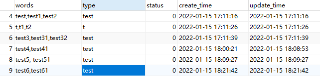
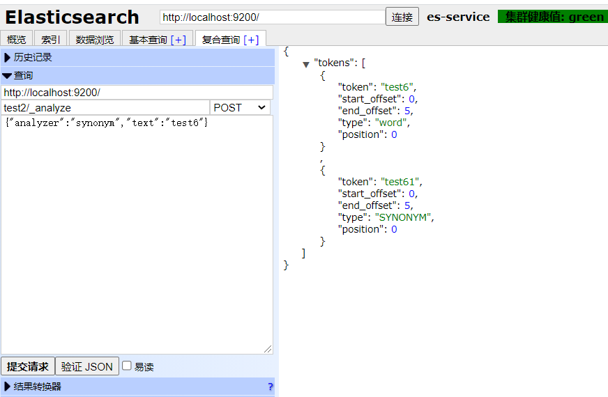

# elasticsearch-analysis-dynamic-synonym 6.6.2
为同义词插件支持MySQL连接获取远程词库。

该源码修改自:

1. [bells / elasticsearch-analysis-dynamic-synonym
](https://github.com/bells/elasticsearch-analysis-dynamic-synonym)
2. [lxc-123 / elasticsearch-analysis-dynamic-synonym-6.5.0](https://github.com/lxc-123/elasticsearch-analysis-dynamic-synonym-6.5.0)

### 使用方法

保留了最初的基本功能，可以参考https://github.com/bells/elasticsearch-analysis-dynamic-synonym 文档。

对于MySQL连接部分，用法如下：

```json
{
	"settings" :{
		"index" : {
			"number_of_shards": "1",
			"number_of_replicas": "0",
			"analysis" : {
				"analyzer" : {
					"synonym" : {
						"tokenizer" : "whitespace",
						"filter" : ["remote_synonym_database"]
					}
				},
				"filter" : {
					"remote_synonym_database" : {
						"type" : "dynamic_synonym",
						"db_url" : "jdbc:mysql://127.0.0.1:3306/database",
						"db_table": "table",
						"db_user": "root",
						"db_pass": "root",
						"dic_type": "test",
						"interval": 30
					}
				}
			}
		}
	},
	"mappings": {
		"doc": {
			"properties":{
				"field1": {
					"type": "text",
					"analyzer": "synonym"
				}
			}
		}
	}
}

```

- `db_url`: 指定数据库链接
- `db_table`: 指定使用的表
- `db_user`, `db_pass`: 数据库连接认证
- `dic_type`: 可以分类型加载不同的词

### 效果如图



